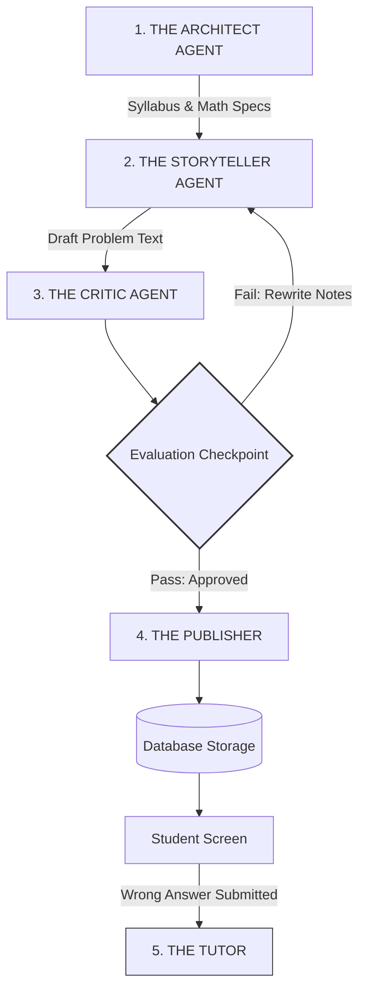

# Project Specification: Multi-Agent Intelligent Question Engine (MAIQE)

## 1. Project Overview
The Multi-Agent Intelligent Question Engine (MAIQE) is an enterprise-grade, adaptive educational platform designed for 10th and 11th-grade students in Kazakhstan (KZ) schools. The primary objective of this system is to decouple **mathematical and pedagogical accuracy** from **creative storytelling**. 

By separating the logic engine from the language engine, the system generates infinitely varied, un-cheatable word problems that map perfectly to state curriculum guidelines (ЕНТ/UNT tracking). The platform combines this with 100% foolproof automated grading and hyper-personalized, hidden AI diagnostic feedback that mimics a real human tutor.

---

## 2. System Architecture & Agent Flow
The system is built as a stateful, cyclic graph managed by **LangGraph**. Unlike linear chains, LangGraph allows for evaluation checkpoints and execution loops (e.g., an editor forcing a writer to redo a draft). A centralized state object passes through the graph, storing math configurations, text drafts, review logs, and student inputs.

## 3. Detailed Agent Breakdown & Heterogeneous Model Routing

To maximize execution efficiency and maintain low API operating costs, the system uses **Heterogeneous Model Routing**. Each agent's node in the graph runs the cheapest tool or model capable of handling that specific task.

### Agent 1: The Architect (The Mind)
* **Objective:** Establish the mathematical parameters and curriculum alignment.
* **Mechanics:** The agent reads the student’s profile and targeted KZ curriculum topic (e.g., finding the area of a curvilinear trapezoid using integrals). It generates mathematically valid parameters (coefficients, limits, equations) ensuring clean, real-number integer outputs.
* **Jinja Integration:** The Architect pulls a topic-specific JSON blueprint (e.g., `calculus_integrals.json`) and uses Jinja to inject the generated numbers, creating a rigid mathematical constraints payload.
* **Model Routing:** **No LLM (Deterministic Python Logic)**. Native code handles this node for 100% mathematical integrity at zero token cost.

### Agent 2: The Storyteller (The Voice)
* **Objective:** Translate raw mathematical expressions into highly engaging, contextually diverse word problems.
* **Mechanics:** It consumes the raw JSON configuration from the Architect. It shuffles creative narrative settings (e.g., architectural engineering in Astana, space logistics, historical narratives) and embeds the variables naturally. It shuffles sentence structures so students cannot visually pattern-match data. It outputs formulas in native LaTeX wrapped in Markdown (`$...$`).
* **Model Routing:** **GPT-5 Mini or DeepSeek V3.2** (or GPT-4o Mini). Optimized for high tokens-per-second and low cost (~$0.25/1M tokens) for pure creative writing and structural formatting.

### Agent 3: The Critic (The Gatekeeper)
* **Objective:** Act as an automated Quality Assurance editor using the **Reflection Pattern**.
* **Mechanics:** The Critic cross-references the Storyteller's draft problem text with the Architect's mathematical parameters. It runs an internal verification loop: *Did the Storyteller alter a number? Does the logic match the equation? Is the text reading level appropriate for high schoolers? Did it accidentally leak the answer?*
* **LangGraph Loop:** If it fails, the Critic logs specific rewrite notes to the state and triggers a loop **backward** to the Storyteller. If it passes, it signs off on the state and moves the token forward.
* **Model Routing:** **DeepSeek R1 or OpenAI o3**. This node requires an advanced reasoning-class model with an internal Chain-of-Thought engine to guarantee safety. DeepSeek R1 lowers premium reasoning costs (~$0.55/1M tokens).

### Agent 4: The Publisher (The Delivery System)
* **Objective:** Compile and execute final database storage.
* **Mechanics:** It extracts the verified text, parses the solution steps, and programmatically computes the absolute evaluation answer key using standard mathematical libraries. It packages the complete payload and writes it directly to the platform database.
* **Model Routing:** **No LLM (Deterministic Python Logic)**. Completely automated code execution node. Cost: $0.00.

### 5. The Tutor Agent (Agent 5 - Real-Time Text Diagnostic Evaluator)
* **Objective:** Deliver hyper-personalized, instant text feedback when a student makes a mistake, pinpointing the exact logical error while completely masking the use of an LLM.
* **Mechanics:** Triggered instantly upon an incorrect answer submission event. It evaluates the problem statement, the mathematical solution blueprint, and the student's exact wrong numerical input. Using a Chain-of-Thought Reflection pattern, it silently reverse-engineers the student's error to find the exact point of failure. It then synthesizes a highly concise, 2–3 sentence conversational plain-text "Margin Note" guiding the student to their mistake without giving away the final answer.
* **Persona Control:** Emulates an empathetic, human high school teacher reviewing a physical paper worksheet. It strictly strips out predictable "AI language clichés" (e.g., *Great effort!*, *Let's break it down*) to sound authentically human and blend seamlessly into the platform's UI.
* **Model Routing:** **Claude 3.5 Sonnet or Claude 4.6 Sonnet**. Anthropic's Sonnet family provides elite capability in persona consistency and tone control, making it exceptionally easy to strip out "AI-isms" and maintain a natural, casual human writing style.

---

## 4. Model Architecture & Cost Optimization Matrix

| Agent | Task Type | Recommended Model | Rationale / Cost Tier |
| :--- | :--- | :--- | :--- |
| **1. The Architect** | Rules & Structuring | Local Python Logic | **Free** ($0.00 compute cost). Native code handles parameter generation for 100% mathematical integrity. |
| **2. The Storyteller** | Fast Creative Writing | DeepSeek V3.2 / GPT-5 Mini | **Ultra-Cheap** (~$0.25 / 1M tokens). High-speed generation optimized for rapid creative phrasing and raw LaTeX formatting. |
| **3. The Critic** | Logical Verification | DeepSeek R1 / OpenAI o3 | **Cheap Reasoning** (~$0.55 / 1M tokens). Advanced reasoning models utilizing internal Chain-of-Thought processing to validate math constraints. |
| **4. The Publisher** | DB Formatting & Math Eval | Local Python Logic | **Free** ($0.00 compute cost). Automated script node executing final programmatic calculation and direct database injection. |
| **5. The Tutor** | Real-Time Text Diagnosis & Persona | Claude 3.5 / 4.6 Sonnet | **Standard** (~$3.00 / 1M tokens). High instruction-following efficiency via short responses (2-3 sentences max). Elite tone-control mechanics to completely eliminate "AI-isms" for natural text feedback. |
---

## 5. Key Implementation Strategies for Scale

1. **Async Pre-Generation (The Batch Discount Hack):** Rather than forcing the student to wait on a live API call to generate a question, the platform runs the generation graph (Agents 1-4) asynchronously in background cron-jobs or queue workers. This allows the platform to utilize **OpenAI’s Batch API (50% cost discount)** to generate thousands of questions per topic during off-peak hours. 
2. **On-Demand Tutor Triggering:** The expensive model call (**The Tutor Agent**) is reserved exclusively for live user interaction when a mistake occurs, protecting the platform's margins.
3. **Prompt Caching:** By leveraging LangGraph's persistent state and maintaining identical system instructions across agent turns, the engine maximizes prompt caching benefits supported by OpenAI and DeepSeek, reducing recurring token ingestion costs up to **90%**.
4. **Infinite Graph Breakout:** To prevent infinite looping costs if the Storyteller and Critic disagree repeatedly, a threshold condition is written into the LangGraph router. If a draft fails the check more than twice, the graph breaks out of the loop and pulls a pre-approved question from a fallback database cache.
