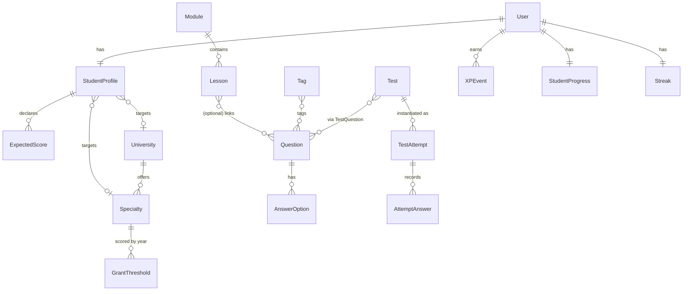

# Data Model Spec — migration-ready

This is the authoritative schema. Field types, nullability, relations, and `on_delete` are
binding — an agent should be able to write migrations directly from this. Apps map 1:1 to the
backend plan: `accounts`, `content`, `assessments`, `analytics` (service-only), `careers`, `gamification`.

## ERD (relationships)



## accounts

```python
class User(AbstractUser):
    # is_staff = content manager (CMS access). Students never have is_staff.
    email = models.EmailField(unique=True)

class StudentProfile(models.Model):
    user = models.OneToOneField(User, on_delete=models.CASCADE, related_name="profile")
    target_university = models.ForeignKey("careers.University", null=True, blank=True, on_delete=models.SET_NULL)
    target_specialty  = models.ForeignKey("careers.Specialty",  null=True, blank=True, on_delete=models.SET_NULL)
    target_score = models.PositiveIntegerField(null=True, blank=True)
    onboarding_completed = models.BooleanField(default=False)

class ExpectedScore(models.Model):
    profile = models.ForeignKey(StudentProfile, on_delete=models.CASCADE, related_name="expected_scores")
    subject = models.CharField(max_length=64)        # e.g. "Грамотность чтения"
    score   = models.PositiveIntegerField()
    class Meta:
        unique_together = ("profile", "subject")
```

## content

```python
class Module(models.Model):
    SUBJECT = [("math_literacy", "Мат. грамотность"), ("profile_math", "Профильная математика")]
    title = models.CharField(max_length=200)
    slug  = models.SlugField(unique=True)
    order = models.PositiveIntegerField(default=0)
    subject = models.CharField(max_length=20, choices=SUBJECT)
    class Meta: ordering = ["order"]

class Lesson(models.Model):
    PROVIDER = [("youtube", "YouTube"), ("vimeo", "Vimeo")]
    module = models.ForeignKey(Module, on_delete=models.CASCADE, related_name="lessons")
    title = models.CharField(max_length=200)
    description = models.TextField(blank=True)
    video_url = models.URLField()
    video_provider = models.CharField(max_length=10, choices=PROVIDER, default="youtube")
    duration_sec = models.PositiveIntegerField(default=0)
    order = models.PositiveIntegerField(default=0)
    class Meta: ordering = ["order"]

class Tag(models.Model):              # THE spine of analytics
    name = models.CharField(max_length=80, unique=True)   # "Логарифмы"
    slug = models.SlugField(unique=True)
```

## assessments

```python
class Question(models.Model):
    text = models.TextField()
    image = models.ImageField(upload_to="questions/", null=True, blank=True)
    explanation = models.TextField()                 # teacher-written solution (required)
    difficulty = models.PositiveSmallIntegerField(default=1)   # 1-3
    lesson = models.ForeignKey("content.Lesson", null=True, blank=True, on_delete=models.SET_NULL, related_name="questions")
    tags = models.ManyToManyField("content.Tag", related_name="questions")   # >=1 enforced in admin

class AnswerOption(models.Model):
    question = models.ForeignKey(Question, on_delete=models.CASCADE, related_name="options")
    text = models.CharField(max_length=500)
    is_correct = models.BooleanField(default=False)  # exactly one True per question (admin-validated)

class Test(models.Model):
    TYPE = [("micro", "Micro"), ("mock", "Mock")]
    type = models.CharField(max_length=10, choices=TYPE)
    title = models.CharField(max_length=200)
    lesson = models.ForeignKey("content.Lesson", null=True, blank=True, on_delete=models.SET_NULL, related_name="tests")
    time_limit_sec = models.PositiveIntegerField(null=True, blank=True)   # null for micro
    questions = models.ManyToManyField(Question, through="TestQuestion")

class TestQuestion(models.Model):
    test = models.ForeignKey(Test, on_delete=models.CASCADE)
    question = models.ForeignKey(Question, on_delete=models.CASCADE)
    order = models.PositiveIntegerField(default=0)
    class Meta: ordering = ["order"]; unique_together = ("test", "question")

class TestAttempt(models.Model):
    student = models.ForeignKey("accounts.User", on_delete=models.CASCADE, related_name="attempts")
    test = models.ForeignKey(Test, on_delete=models.CASCADE)
    started_at = models.DateTimeField(auto_now_add=True)
    finished_at = models.DateTimeField(null=True, blank=True)
    score = models.FloatField(null=True, blank=True)
    is_completed = models.BooleanField(default=False)
    class Meta: indexes = [models.Index(fields=["student", "is_completed"])]

class AttemptAnswer(models.Model):
    attempt = models.ForeignKey(TestAttempt, on_delete=models.CASCADE, related_name="answers")
    question = models.ForeignKey(Question, on_delete=models.CASCADE)
    selected_option = models.ForeignKey(AnswerOption, null=True, on_delete=models.SET_NULL)
    is_correct = models.BooleanField(default=False)
    class Meta: unique_together = ("attempt", "question")
```

## careers (JUNIOR owns)

```python
class University(models.Model):
    name = models.CharField(max_length=200)
    city = models.CharField(max_length=100)
    code = models.CharField(max_length=20, unique=True)

class Specialty(models.Model):
    university = models.ForeignKey(University, on_delete=models.CASCADE, related_name="specialties")
    name = models.CharField(max_length=200)
    code = models.CharField(max_length=20)
    required_subjects = models.JSONField(default=list)   # config; see ENT formula below
    class Meta: unique_together = ("university", "code")

class GrantThreshold(models.Model):
    specialty = models.ForeignKey(Specialty, on_delete=models.CASCADE, related_name="thresholds")
    year = models.PositiveIntegerField()
    min_score = models.PositiveIntegerField()            # Excel-imported
    class Meta: unique_together = ("specialty", "year"); indexes = [models.Index(fields=["year"])]
```

## gamification

```python
class XPEvent(models.Model):
    REASON = [("video", "Video watched"), ("correct_answer", "Correct answer")]
    student = models.ForeignKey("accounts.User", on_delete=models.CASCADE, related_name="xp_events")
    amount = models.PositiveIntegerField()
    reason = models.CharField(max_length=20, choices=REASON)
    created_at = models.DateTimeField(auto_now_add=True)

class StudentProgress(models.Model):
    student = models.OneToOneField("accounts.User", on_delete=models.CASCADE, related_name="progress")
    total_xp = models.PositiveIntegerField(default=0)
    level_code = models.CharField(max_length=20, default="novice")

class Streak(models.Model):
    student = models.OneToOneField("accounts.User", on_delete=models.CASCADE, related_name="streak")
    current_streak = models.PositiveIntegerField(default=0)
    longest_streak = models.PositiveIntegerField(default=0)
    last_active_date = models.DateField(null=True, blank=True)
```

## Business config (not hardcoded in logic — keep in `settings`/config)

```python
XP_RULES = {"video": 10, "correct_answer": 5}            # spec §3.5

LEVELS = [   # (min_total_xp, code, label)
    (0, "novice", "Новичок"),
    (1000, "znatok", "Знаток"),
    (5000, "geniy", "Гений"),
]

# ENT GRANT FORMULA — ⚠ CONFIRM against current-year rules before shipping (README blocker #2)
ENT_CONFIG = {
    "math_subject": "profile_math",   # the subject we actually test
    "other_subjects": [               # estimated in onboarding; names must match ExpectedScore.subject
        "История Казахстана", "Грамотность чтения",
        "Математическая грамотность", "Профильный предмет 2",
    ],
    "max_total_score": 140,           # placeholder — confirm
}
# predicted = latest completed math mock score + sum(expected other-subject scores)
```

## Invariants the agent must enforce

- A published `Question` has ≥1 `Tag` and **exactly one** `AnswerOption.is_correct = True` (admin validation).
- `TagStat.percent` is null-safe: `0` when `total == 0`, never a division error.
- Streak increments only once per calendar day; a missed day resets `current_streak` to 1 on next activity.
- The grant calculator requires a **completed** math mock attempt; otherwise return HTTP 409 (per contract).
